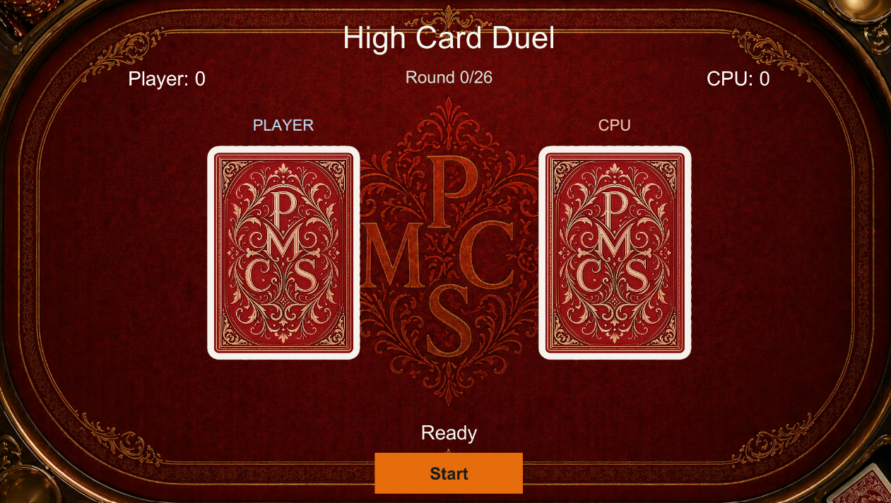

# High Card Duel (Unity)
> ⚙️ Developed entirely by Pedro Martins Costa de Souza — game programmer with experience in Unity/C#, Python, .NET, AWS, Docker, and game systems.  
> 🚀 Currently open to remote opportunities in game development (full-time or freelance).  
> 📫 Contact: pedro@nancode.com.br | [LinkedIn](https://www.linkedin.com/in/pedromartinscosta/) | [Portfolio](https://github.com/pedromartinscs)

A polished Unity card game demo built to showcase a clean, expandable card-game foundation for mobile, tablet, and PC.

High Card Duel uses a standard 52-card deck, custom PMCS card visuals, animated card reveals, score tracking, background music, sound effects, and a casino-style table presentation.

## ✅ Features

- Standard 52-card deck logic
- Automated 26-round match flow
- Player vs CPU scoring
- Card flip/reveal animation
- Custom card back design
- Custom card front layout
- Stylized suit icons
- Casino table background
- Background music support
- Card flip sound effect support
- Restartable game loop
- Clean Unity/C# project structure

## 🎮 Gameplay

The game is intentionally simple and presentation-focused:

- A standard 52-card deck is shuffled.
- The deck is split into two 26-card hands.
- Each round, the player and CPU reveal one card.
- The higher card wins 1 point.
- If both cards have the same value, both players gain 1 point.
- After 26 rounds, the final winner is shown.

This simple rule set allows the demo to focus on polish, pacing, UI, animations, and card-game structure.

## 🎯 Project Goals

This project was created as a compact portfolio demo showing how a card game can be structured and presented in Unity.

The focus is on:

- clean gameplay logic
- readable card state management
- polished visual presentation
- expandable UI structure
- mobile/PC-friendly design direction
- fast prototyping workflow

## 🛠️ Built With

- Unity
- C#
- TextMeshPro
- Unity UI
- Custom 2D card/table assets
- Audio integration for music and SFX

## 🚀 How to Run

1. Clone the repository.
2. Open the project in Unity.
3. Open the main scene.
4. Press Play.
5. Click Start Game.

## 📁 Folder Structure

```text
Assets/
  Art/
    Backgrounds/
    Cards/
      Backgrounds/
      Backs/
      Suits/
  Audio/
    Music/
    SFX/
  Scripts/
    Cards/
    Game/
    UI/
    Audio/
  Scenes/
```

## 📸 Screenshots

### Gameplay



## 🔮 Possible Next Improvements

- Manual player interaction
- Additional card game modes
- Main menu polish
- Mobile layout tuning
- Settings menu
- Volume controls
- More animations and particle effects
- Android build
- WebGL build
- Multiplayer support

---

Built with ❤️ by [Pedro Martins Costa de Souza](https://github.com/pedromartinscs)
